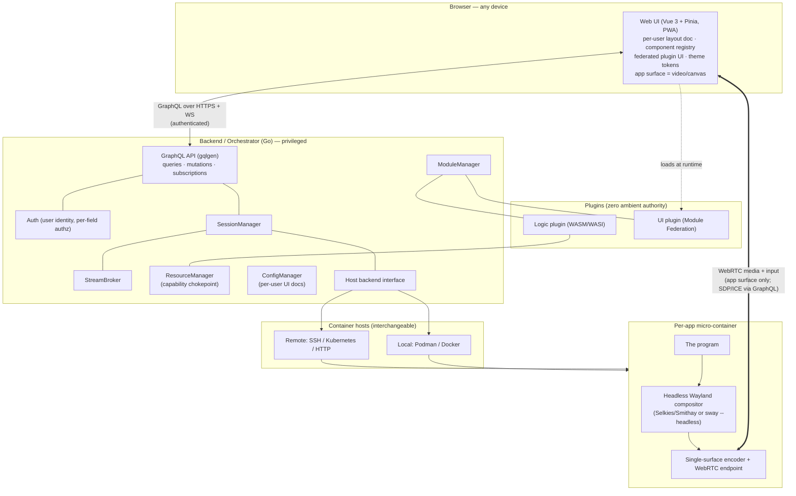
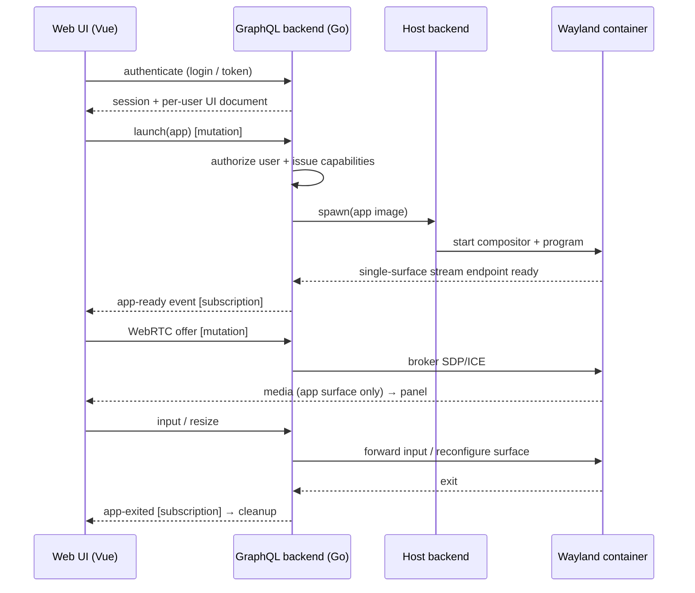
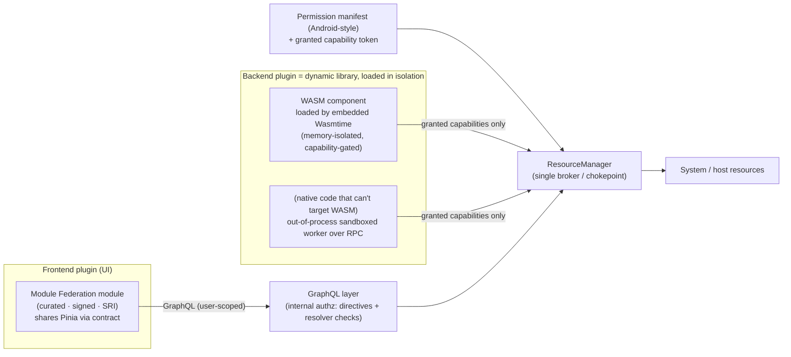

# SandboxDesktop — Architecture

> Status: design / pre-implementation. This document is the source of truth for the project's
> direction. Individual decisions are recorded as ADRs under [`adr/`](adr/).

## 1. Goal & principles

SandboxDesktop uses the browser to hold the **full user interface**. Programs do not run against the
user's local display server; each runs inside its own **Wayland** micro-container — locally or on a
remote host — and only that program's content is streamed into a web UI.

Principles:

1. **The UI is a website.** A Vue 3 PWA, openable in any browser. No embedded browser engine.
2. **It behaves like a normal web app.** An **authenticated user** talks to a **GraphQL** backend; the
   backend is the single privileged layer with system access.
3. **One program, one sandbox.** Each app is a single-purpose Wayland micro-container.
4. **Stream only the application content.** Not a whole desktop — one app surface, damage-tracked, to
   keep bandwidth low.
5. **Wayland-native, no X11.** Per-client isolation is a security requirement, not a preference.
6. **Local ≈ remote.** Where a container runs is a backend detail behind one interface.
7. **Per-user, modular UI.** Each user gets their own editable interface; plugins can change it.
8. **Secure by capability.** Plugins start with zero authority and receive only what they are granted.

This is **not a window manager** and **not** a single embedded-browser app. It is a per-application,
container-backed **streaming workspace**.

## 2. High-level architecture

### Components

- **Web UI — Vue 3 + Pinia (PWA).** The whole interface, rendered from a **per-user layout document**
  (see §7): panels, launcher, command palette, and plugin-contributed UI. Each running app appears as a
  `<video>`/canvas surface fed by its WebRTC stream. **Pinia** holds session/app-instance/layout state
  and is shared with federated plugins via an interface contract. Shipped as static assets; installable
  as a PWA.
- **Backend / Orchestrator — Go (privileged).** A single binary and the **only** component with system
  access. It exposes a **GraphQL API** (gqlgen): **queries/mutations** for control (list/launch/stop
  apps, save layout, manage plugins) and **subscriptions** (over `graphql-transport-ws`) for real-time
  events (app ready/exited, stream offers, focus). All requests are **authenticated** (§4). Subsystems:
  `SessionManager` (lifecycle), `StreamBroker` (WebRTC negotiation), `ModuleManager` (plugins),
  `ResourceManager` (the capability-enforcement chokepoint), `ConfigManager` (per-user UI docs). The
  retired original `WindowManager` name is dropped.
- **Host backend abstraction.** One Go interface, two implementations: **local** (Podman/Docker socket)
  and **remote** (SSH / Kubernetes / HTTP API). Interchangeable from day one.
- **Per-app micro-container.** Runs one program against a **headless Wayland compositor** (Selkies's
  Rust/Smithay compositor, or `sway --headless`), exposing a **single-surface** WebRTC endpoint.
- **Stream transport.** WebRTC for low-latency, GPU-accelerated media (H.264 / H.265 / AV1) with an
  input back-channel; WebSocket pixel fallback. The backend brokers and authorizes session setup
  (SDP/ICE through GraphQL), but media flows browser ↔ container directly, carrying **only the app's
  content** (§5).
- **Plugins.** Two kinds, both starting from **zero authority** (§6): **logic plugins** as WASM/WASI
  components brokered through `ResourceManager`, and **UI plugins** loaded via curated **Module
  Federation**. App/GUI plugins are just per-app containers.

## 3. Data flow

## 4. Authentication & API

The system behaves like a conventional web application (see
[ADR-0007](adr/0007-authenticated-graphql-backend.md)).

- **One authenticated entry point.** Every interaction goes through the **GraphQL** backend over HTTPS
  (queries/mutations) and a WebSocket (subscriptions). The backend is the **only** component holding
  system access — the browser never touches the host or containers directly except for brokered WebRTC
  media.
- **Auth.** Pluggable identity: built-in accounts to start, **OIDC**-ready. Tokens are verified on HTTP
  requests and in the **WebSocket init payload** (the gqlgen subscription auth pattern); the
  authenticated user is placed in the resolver context.
- **Access rights are managed internally by GraphQL.** Authorization is a **backend** concern, enforced
  *inside* the GraphQL layer — declarative **schema directives** (e.g. `@auth`, `@hasPermission`) plus
  per-resolver checks against the user in context. Clients and plugins never make access-control
  decisions; they only receive what the resolvers are willing to return.
- **Capability brokering.** When a user launches an app or a plugin acts, the backend mints scoped
  capabilities (§6) and enforces them in `ResourceManager`. There is no ambient access — the backend's
  system privilege is never delegated wholesale.

## 5. Streaming: only the application content

To minimize bandwidth, **only the program's own surface is streamed** — never a desktop, wallpaper, or
other windows (see [ADR-0008](adr/0008-stream-only-application-content.md)).

- **It falls out of the model.** Each program already runs alone in its own headless compositor
  (§2, ADR-0005), so "the desktop" *is* the single app. The encoder captures that **one toplevel
  surface**.
- **Damage tracking.** The compositor reports changed regions; only those are encoded and sent, so an
  idle app costs ~no bandwidth and a partially-updating app sends only its delta.
- **Adaptive.** Codec (H.264/H.265/AV1) and bitrate adapt to the link, with a low-bandwidth mode
  (borrowed from Shadow's playbook, §10).
- **Prior art.** *waypipe* forwards a single Wayland app's protocol/buffers over one socket (lz4/zstd);
  the *XDG `ScreenCast` portal + PipeWire* path supports **per-window** capture into an encoder. Our
  per-app compositor makes single-surface capture the default rather than a special case.

## 6. Plugin system & security

Plugins must be **very secure**: the design assumes a plugin should be able to do *only* what it was
explicitly granted, and nothing else. The unifying rule is **capability-based, zero ambient authority**,
with an **Android-style permission model** — every plugin declares the authorizations it needs and runs
only with those that were granted.

**Backend plugins** (see [ADR-0009](adr/0009-backend-plugin-security-capability-model.md)) are **dynamic
libraries the Go backend loads in isolation** — never linked into the host process with ambient access:

- **The isolated dynamic-library mechanism is WASM.** A plugin is a dynamically-loaded **WASM Component
  Model / WASI** module that the backend loads via an **embedded Wasmtime runtime**. This is a true
  "dynamic library loaded in isolation": memory-isolated from the host, zero ambient authority,
  filesystem/network capability-gated, with typed interfaces via WIT. **Native in-process `.so`/`dlopen`
  (Go `plugin`) is rejected** — it shares the host address space, so a fault or exploit compromises the
  whole backend. Native code that cannot target WASM runs instead as an **out-of-process sandboxed
  worker over RPC** (hashicorp/go-plugin style), still outside the host's address space.
- **Android-style declared permissions.** Each plugin ships a **permission manifest** listing the
  authorizations it requires (which paths, hosts, devices, GraphQL operations). `ModuleManager` validates
  it; the user grants it at install; the plugin receives a scoped, revocable **capability token** (the
  through-line from the original README's "module token = rights"). Ungranted permissions simply do not
  exist for that plugin.
- **Brokered access only.** No plugin touches the host directly; every privileged action goes through
  `ResourceManager`, which enforces the granted permissions, applies resource limits, and audits.
- **Programs vs plugins.** User *programs/apps* (the software you run and stream) are the per-app
  **Wayland containers** of §2/ADR-0005; *plugins* (which extend the backend) are the isolated dynamic
  modules above. The two are different things.

**Frontend plugins** (see [ADR-0010](adr/0010-frontend-plugins-module-federation.md)):

- Loaded via **curated Module Federation** (Vite). They run in the app context and may share Pinia, so
  the **trust gate is the security boundary**: plugin **review + signing + Subresource Integrity** + a
  **stable plugin API contract**, with **CSP** as defense-in-depth. Any privileged data still comes only
  through the user-scoped GraphQL API.
- A future **untrusted tier** can run UI in a **sandboxed `<iframe>` + postMessage** capability bridge
  (the Figma model) without changing the contract.

## 7. Frontend customization: three overloadable levels

The frontend is modular and **different for each user**, and **plugins can change it**. Customization is
organized as **three layered levels**, each with a **defined interface** that can be **overloaded** — the
WordPress model of child themes, the template hierarchy, and pluggable blocks (see
[ADR-0011](adr/0011-three-tier-customization-overrides.md)).

| Level | What it controls | Defined interface | Overload mechanism (WordPress analogue) |
|-------|------------------|-------------------|------------------------------------------|
| **1 · Theme** | Look & feel — colors, spacing, type | A named set of **design tokens** (CSS custom properties) + global styles | A theme **extends/overrides** another's tokens (child theme overrides parent) |
| **2 · Interface** | Which regions/panels exist and how they're arranged | A **layout schema** — named slots/regions + a per-user layout document | A theme or plugin ships an Interface template; a more specific provider overrides it (template hierarchy) |
| **3 · Component** | The implementation of an individual widget | A **component contract** — props/slots/events schema + themeable `::part()`s | Any provider **re-registers** a component id with its own implementation behind the same contract (pluggable functions / block variations) |

- **Override resolution — most specific wins.** For every token, slot, and component id the system
  resolves a provider in priority order: **per-user/per-instance config → enabled plugins → active theme
  → built-in defaults**. Because each level has a stable contract, an override is drop-in — a plugin can
  replace a single component without the rest of the UI knowing, exactly as a WordPress plugin overloads
  a pluggable function.
- **Theme (L1)** is realized with **design tokens** as CSS custom properties consumed by **Web Components
  Shadow DOM**; tokens pierce the shadow boundary for theming and **`::part()`** exposes internals for
  structural overrides — the component author decides what is themeable (a safe public styling contract).
- **Interface (L2)** is **UI-as-data** (see [ADR-0012](adr/0012-per-user-editable-ui-as-data.md)): each
  user's interface is a **serializable layout document** (slots → component refs + props + bound tokens +
  geometry), rendered by the Vue shell via `<component :is>`. An **edit mode** lets the user
  rearrange/resize/add/remove panels (drag-drop) and restyle via tokens. No code authoring.
- **Component (L3)** entries live in a **component registry**, each declaring its contract (props schema
  for the editor). Host components, theme-provided components, and **federated plugin components**
  register the same way and are interchangeable behind the contract.
- **Per-user persistence.** A user's selected theme, layout document, and enabled plugins/overrides are
  keyed to the authenticated user and stored via `ConfigManager`; on login the backend returns them and
  the shell renders that user's resolved interface — hence a **different interface per user**.

## 8. Technology challenge

The original stack (see git history) was re-founded. Each choice was challenged:

| Original | Verdict | Recommendation & why |
|----------|---------|----------------------|
| **React** | Replaced | **Vue 3**. Single-file components + fine-grained reactivity suit a streaming, data-driven workspace; per project direction. |
| **Redux** | Replaced | **Pinia**. State is sessions + app instances + per-user layout — Pinia's light stores fit and are shared with federated plugins via contract; Redux boilerplate was unjustified. |
| **Python (core)** | Demoted | Kept only for **plugins** (logic plugins compile to WASM; app plugins are containers); a poor fit for the latency-sensitive privileged core. |
| **Flask + REST** | Replaced | **Go** backend exposing **GraphQL** (queries/mutations/subscriptions). REST polling cannot carry real-time stream/session events; GraphQL gives one authenticated, typed contract; Go gives concurrency + a single deployable binary. |
| **CEF (embedded Chromium)** | Dropped | "The UI is a website" → a **Vue PWA** in any browser. No embedded Chromium, no Electron/Tauri — lighter and truer to the goal. |
| **X11** | Removed | **Wayland only** (§9). |

## 9. Wayland-only investigation

**Decision: commit fully to Wayland; no X11, no XWayland fallback.** (See
[ADR-0002](adr/0002-wayland-only-no-x11.md).)

- **Isolation (decisive).** Under X11 any client can read every other client's input and window
  contents. For a system that runs **untrusted user modules**, that is disqualifying. Wayland isolates
  each client to its own surface — apps cannot snoop each other.
- **Streaming efficiency.** Wayland's **damage tracking** lets the compositor encode only the regions
  that changed (§5), which pairs naturally with WebRTC/GStreamer for low-latency, GPU-accelerated frames.
- **Maturity (2026).** Selkies — the engine behind **Webtop 4.x** — runs apps on a headless Wayland
  compositor (Rust/Smithay) and streams to the browser over WebRTC/WebSocket. Webtop explicitly
  **dropped X11/KasmVNC**. The Wayland path is now the production-grade one.
- **No XWayland.** Keeping the stack purely Wayland preserves the isolation model and keeps the runtime
  lean. **Legacy X11-only apps are an explicit non-goal.**

## 10. Reference systems (including Shadow)

| System | Model | Transport | Granularity | Relation to this project |
|--------|-------|-----------|-------------|--------------------------|
| **Shadow** | Whole Windows PC in the cloud | **Proprietary** (H.265, ~20–50 ms), thin "any browser" client | Whole machine | Reference *ceiling*. Borrow: codec strategy (H.265/AV1), adaptive low-bandwidth mode, overlap decode+display to cut latency. Reject: proprietary protocol, whole-OS granularity. |
| **Selkies / Webtop** | Containerized Linux desktop | Open WebRTC/WebSocket, Wayland/Smithay | Whole desktop | Closest base to build on or vendor. |
| **Kasm / neko** | Containerized app/desktop streaming | WebRTC | Desktop / single app | Precedents for container-per-session streaming. |
| **SandboxDesktop** | Per-app sandbox workspace | Open WebRTC | **Per application** | Open transport (like Selkies) + **per-application** Wayland containers (finer than Shadow/Webtop) + a per-user Vue workspace. |

Note on Shadow: they chose a **proprietary heavyweight protocol over WebRTC** deliberately, because
"WebRTC doesn't allow some things." That is the right call for a commercial whole-PC product chasing
peak latency; it is the **wrong** call here, where openness, browser-native clients, and per-app
granularity matter more than the last few milliseconds.

## 11. Sandboxing posture

- One program per container; **Podman rootless** as the baseline.
- **gVisor** (or **Kata Containers**) as opt-in stronger isolation for untrusted modules, where the
  per-syscall / VM boundary is worth the overhead.
- **WASM/WASI** capability sandboxing for logic plugins (§6) — zero ambient authority in-process.
- Wayland per-client isolation (§9) is the in-container complement to container-level isolation.

## 12. Roadmap

1. **P1 — Docs.** This architecture + the ADRs. *(current)*
2. **P2 — PoC.** One Wayland app in a container, single-surface stream to a static page; validate the
   Selkies path and the app-content-only stream.
3. **P3 — Backend + UI.** Go GraphQL backend (`SessionManager`/`StreamBroker` + auth + host abstraction)
   and the per-user Vue workspace (layout document + component registry + edit mode + theming).
4. **P4 — Plugin SDK.** WASM/WASI logic-plugin SDK + container app-plugin recipe with capability
   manifests/tokens, plus the Module Federation contract for UI plugins.

## Sources

- LinuxServer Webtop 4.0 — Wayland: <https://www.linuxserver.io/blog/webtop-4-0-wayland-is-here-engage-the-reality-engine>
- LinuxServer Webtop 4.1 — "X11 is dead / what is Selkies": <https://www.linuxserver.io/blog/webtop-4-1-x11-is-dead-and-what-is-selkies-anyway>
- Selkies project: <https://github.com/selkies-project/selkies>
- waypipe (single-app Wayland forwarding): <https://gitlab.freedesktop.org/mstoeckl/waypipe>
- XDG ScreenCast portal / PipeWire screen capture: <https://flatpak.github.io/xdg-desktop-portal/docs/doc-org.freedesktop.portal.ScreenCast.html>
- gqlgen — GraphQL subscriptions & auth (Go): <https://gqlgen.com/recipes/subscriptions/> · <https://gqlgen.com/recipes/authentication/>
- WASI / WebAssembly Component Model: <https://wasi.dev/> · <https://component-model.bytecodealliance.org/>
- Wasmtime security model: <https://docs.wasmtime.dev/security.html>
- Vite Module Federation: <https://github.com/originjs/vite-plugin-federation>
- Web Components / Shadow DOM `::part()` styling: <https://developer.mozilla.org/en-US/docs/Web/CSS/::part>
- Figma plugin security model (untrusted-UI reference): <https://www.figma.com/blog/how-we-built-the-figma-plugin-system/>
- neko (self-hosted WebRTC browser/app streaming): <https://github.com/m1k1o/neko>
- Shadow: <https://shadow.tech> · <https://en.wikipedia.org/wiki/Shadow.tech>
- gVisor: <https://gvisor.dev/>
