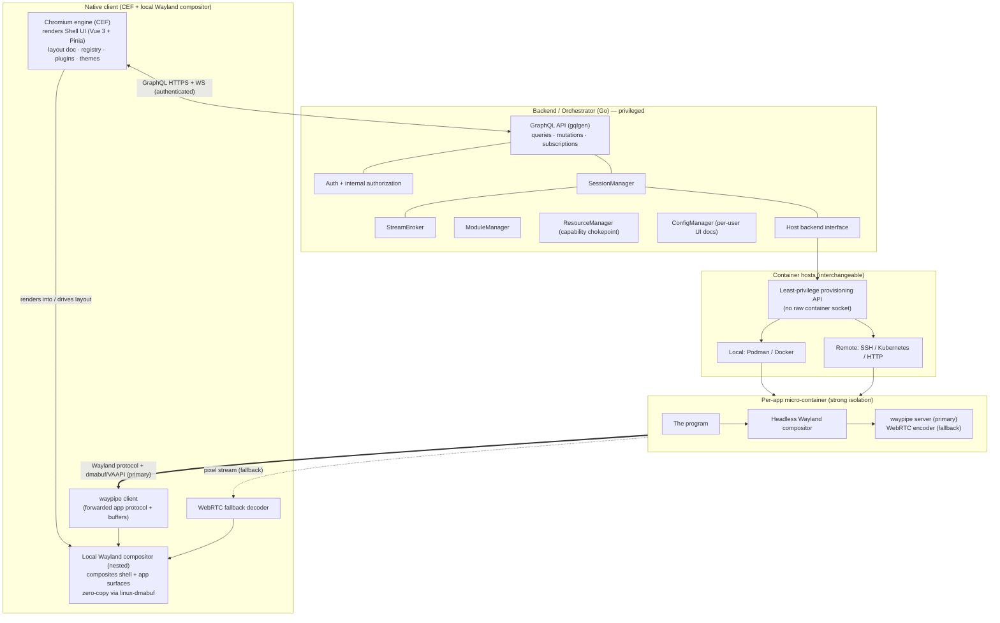
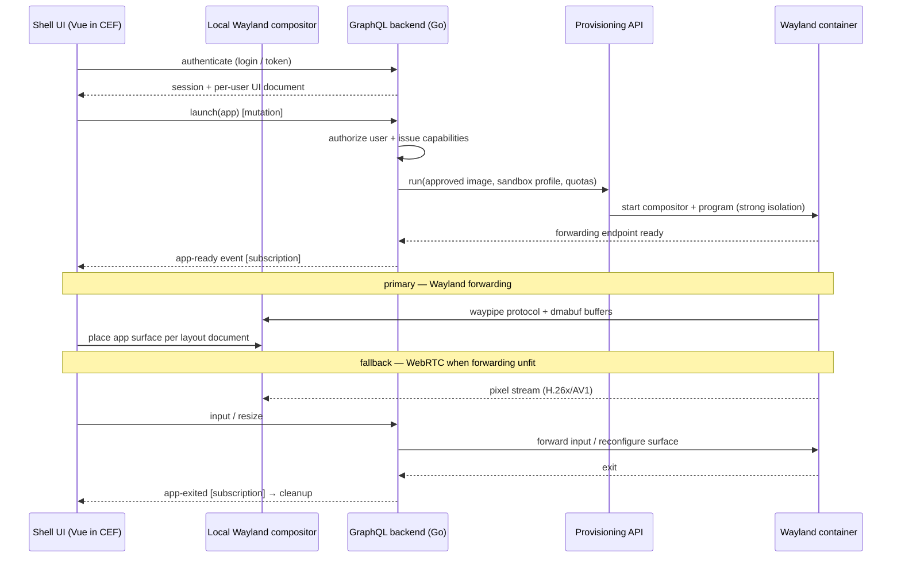

# SandboxDesktop — Architecture

> Status: design / pre-implementation. This document is the source of truth for the project's
> direction. Individual decisions are recorded as ADRs under [`adr/`](adr/). For the critical view —
> usage limits and the threat model — see [LIMITATIONS.md](LIMITATIONS.md); for concrete mitigations see
> [SECURITY.md](SECURITY.md); for existing projects to build on per layer see [TOOLING.md](TOOLING.md).

## 1. Goal & principles

SandboxDesktop holds the **full user interface** with web technology rendered by the **Chromium engine**,
packaged as a **native client**. Programs do not run against the user's display server; each runs inside
its own **Wayland** micro-container — locally or on a remote host — and only that program's content is
delivered to the client, which **composites and renders it locally**.

Principles:

1. **The UI is web tech in a native client.** The interface is Vue 3, rendered by an embedded **Chromium
   engine (CEF)** inside a native client — not a page served to arbitrary browsers. "Web app" here means
   *web technology + Chromium*, packaged natively (the project's original CEF direction, now with a clear
   architecture).
2. **The client renders, not just displays.** The native client runs a **local Wayland compositor** and
   receives each app's **Wayland protocol + buffers** (waypipe-style), compositing them locally — cheaper
   than always streaming pixels. WebRTC pixel-streaming is the fallback.
3. **It behaves like a web app to the backend.** An **authenticated user** talks to a **GraphQL** backend;
   the backend is the single privileged layer with system access.
4. **One program, one sandbox.** Each app is a single-purpose Wayland micro-container.
5. **Deliver only the application content.** One app surface, not a whole desktop.
6. **Wayland-native, no system X11.** Per-client isolation is a security requirement; the ecosystem has
   moved to Wayland (§9).
7. **Local ≈ remote.** Where a container runs is a backend detail behind one interface.
8. **Per-user, modular UI.** Each user gets their own editable interface; plugins can change it.
9. **Secure by capability.** Plugins start with zero authority and receive only what they are granted.

This is **not a window manager**. It is a native client whose UI is rendered by an embedded Chromium
engine, hosting **per-application** streamed/forwarded surfaces in a per-user workspace.

## 2. High-level architecture

### Components

- **Native client — CEF + local Wayland compositor.** The client is a native application that:
  - embeds the **Chromium engine (CEF)** to render the **Shell UI** (Vue 3 + Pinia) — the per-user layout
    document (§7), launcher, command palette, plugin UI, theme tokens;
  - runs a **local, nested Wayland compositor** (wlroots/Smithay-class, à la ChromeOS *Sommelier*) that
    composites both the CEF shell surface and the remote app surfaces, sharing GPU buffers **zero-copy via
    `linux-dmabuf`**; the shell defines the layout and the compositor positions app surfaces to match;
  - includes a **waypipe client** (primary transport) and a **WebRTC decoder** (fallback), plus client-side
    tools for input, clipboard, and audio.
  There is **no plain-browser client** (ADR-0014).
- **Backend / Orchestrator — Go (privileged).** The **only** component with system access. Exposes a
  **GraphQL API** (gqlgen): **queries/mutations** (list/launch/stop apps, save layout, manage plugins) and
  **subscriptions** over `graphql-transport-ws` (app ready/exited, session events). All requests
  **authenticated**, with authorization enforced **internally** (§4). Subsystems: `SessionManager`,
  `StreamBroker` (transport negotiation), `ModuleManager` (plugins), `ResourceManager` (capability
  chokepoint), `ConfigManager` (per-user UI docs). The original `WindowManager` name is retired.
- **Host backend abstraction.** One Go interface, two implementations — **local** (Podman/Docker) and
  **remote** (SSH / Kubernetes / HTTP) — interchangeable from day one. The backend never touches a raw
  container socket; each sits behind a **least-privilege provisioning API** that only runs approved images
  under a sandbox profile with quotas and an egress policy (ADR-0013).
- **Per-app micro-container.** Runs one program against a **headless Wayland compositor** under
  **strong-by-default isolation** (microVM/gVisor/Kata, ADR-0013). It exposes a **waypipe server**
  (primary) and a **WebRTC encoder** (fallback).
- **Transport.** **Primary:** waypipe-style **Wayland protocol + buffer forwarding** (dmabuf, optional
  VAAPI video) to the client's local compositor — cheaper for typical GUIs, rendered locally.
  **Fallback:** **WebRTC** pixel-streaming (H.264/H.265/AV1) for heavy/animated surfaces or constrained
  paths. The backend brokers and authorizes session setup (via GraphQL); media flows client ↔ container.
- **Plugins.** Two kinds, both from **zero authority** (§6): **logic plugins** as isolated WASM modules,
  and **UI plugins** via curated Module Federation rendered inside the CEF shell.

## 3. Data flow

## 4. Authentication & API

The client talks to the backend like a conventional web application (see
[ADR-0007](adr/0007-authenticated-graphql-backend.md)).

- **One authenticated entry point.** All control goes through the **GraphQL** backend over HTTPS
  (queries/mutations) and a WebSocket (subscriptions). The backend is the **only** component with system
  access; the client only also holds brokered media/forwarding sessions to containers.
- **Auth.** Pluggable identity: built-in accounts to start, **OIDC**-ready. Tokens verified on HTTP and in
  the **WebSocket init payload**; the authenticated user is placed in the resolver context.
- **Access rights are managed internally by GraphQL** — declarative **schema directives** (`@auth`,
  `@hasPermission`) plus per-resolver checks. Clients and plugins never make access-control decisions.
- **Capability brokering.** Launching an app or a plugin action mints scoped capabilities (§6) enforced in
  `ResourceManager`; no ambient access.

## 5. Delivering only the application content

**Only the program's own surface is delivered** — never a desktop or other windows (see
[ADR-0008](adr/0008-stream-only-application-content.md)).

- **Why forwarding, not just pixels.** **Wayland has no drawing-command protocol** (unlike X11): clients
  render their own pixels into `dmabuf`/shared-memory **buffers**. waypipe forwards the protocol *plus
  those buffers* (compressed; optional VAAPI video for large/changing surfaces) to the client's **local
  compositor**, which renders them. For typical, mostly-static GUIs this is cheaper than continuously
  encoding video; for animation/video it falls back to a codec.
- **It falls out of the model.** Each program runs alone in its own headless compositor (§2, ADR-0005), so
  "the desktop" *is* the single app — one surface to forward or capture.
- **Fallback.** WebRTC single-surface pixel-streaming (damage-tracked, adaptive H.264/H.265/AV1) covers
  heavy surfaces and any path where forwarding is unavailable.

## 6. Plugin system & security

Plugins must be **very secure**: a plugin should do *only* what it was explicitly granted. The unifying
rule is **capability-based, zero ambient authority**, with an **Android-style permission model** — every
plugin declares the authorizations it needs and runs only with those granted.

**Backend plugins** (see [ADR-0009](adr/0009-backend-plugin-security-capability-model.md)) are **dynamic
libraries the Go backend loads in isolation** — never linked into the host with ambient access:

- **The isolated dynamic-library mechanism is WASM.** A plugin is a dynamically-loaded **WASM Component
  Model / WASI** module loaded via an **embedded Wasmtime runtime**: memory-isolated, zero ambient
  authority, filesystem/network capability-gated, typed via WIT. **Native in-process `.so`/`dlopen` is
  rejected** (shares the host address space). Native code that cannot target WASM runs as an
  **out-of-process sandboxed worker over RPC**.
- **Android-style declared permissions.** Each plugin ships a **permission manifest**; `ModuleManager`
  validates it, the user grants it at install, and the plugin gets a scoped, revocable **capability
  token**. Ungranted permissions do not exist for it.
- **Brokered access only.** Every privileged action goes through `ResourceManager` (enforces permissions,
  applies limits, audits).
- **Programs vs plugins.** User *programs* are per-app Wayland containers (§2/ADR-0005); *plugins* extend
  the backend and use the isolated-module model above.

**Frontend plugins** (see [ADR-0010](adr/0010-frontend-plugins-module-federation.md)) load via **curated
Module Federation** and render inside the CEF shell, sharing Pinia via a contract; the **trust gate**
(review + signing + SRI + stable contract, CSP defense-in-depth) is the security boundary. A future
untrusted tier can run UI in a sandboxed surface without changing the contract.

## 7. Frontend customization: three overloadable levels

The frontend is modular and **different for each user**, and **plugins can change it**. Customization has
**three layered levels**, each a **defined interface** that can be **overloaded** — the WordPress model of
child themes, the template hierarchy, and pluggable blocks (see
[ADR-0011](adr/0011-three-tier-customization-overrides.md)).

| Level | What it controls | Defined interface | Overload mechanism (WordPress analogue) |
|-------|------------------|-------------------|------------------------------------------|
| **1 · Theme** | Look & feel — colors, spacing, type | A named set of **design tokens** (CSS custom properties) + global styles | A theme **extends/overrides** another's tokens (child theme overrides parent) |
| **2 · Interface** | Which regions/panels exist and how they're arranged | A **layout schema** — named slots/regions + a per-user layout document | A theme or plugin ships an Interface template; a more specific provider overrides it (template hierarchy) |
| **3 · Component** | The implementation of an individual widget | A **component contract** — props/slots/events schema + themeable `::part()`s | Any provider **re-registers** a component id with its own implementation behind the same contract (pluggable functions / block variations) |

- **Override resolution — most specific wins:** **per-user/per-instance → enabled plugins → active theme →
  built-in default**. Stable contracts make every override drop-in.
- **Theme (L1)** = **design tokens** as CSS custom properties consumed by **Web Components Shadow DOM**;
  tokens pierce the shadow boundary, **`::part()`** exposes internals for structural overrides.
- **Interface (L2)** = **UI-as-data** (see [ADR-0012](adr/0012-per-user-editable-ui-as-data.md)): a
  **serializable layout document** (slots → component refs + props + tokens + geometry) rendered via
  `<component :is>`; an **edit mode** rearranges panels and restyles via tokens. No code authoring.
- **Component (L3)** entries live in a **component registry** declaring their contract; host, theme, and
  federated plugin components register the same way and are interchangeable.
- **Per-user persistence.** Theme + layout document + enabled plugins are keyed to the user and stored via
  `ConfigManager`; on login the backend returns them and the shell renders the resolved interface.

## 8. Technology challenge

The original stack (see git history) was re-founded, then iterated. Current verdicts:

| Original | Verdict | Recommendation & why |
|----------|---------|----------------------|
| **React** | Replaced | **Vue 3** — SFCs + reactivity suit a data-driven workspace, rendered by the Chromium engine. |
| **Redux** | Replaced | **Pinia** — state is sessions + app instances + per-user layout; shared with federated plugins via contract. |
| **Python (core)** | Demoted | Kept only for **plugins** (logic plugins compile to WASM); poor fit for the latency-sensitive privileged core. |
| **Flask + REST** | Replaced | **Go** + **GraphQL** (queries/mutations/subscriptions) — one authenticated, typed contract with internal authz. |
| **CEF (embedded Chromium)** | **Reinstated** | The project's original CEF direction is restored: a **native client embedding the Chromium engine** renders the UI, and a **local Wayland compositor** composites forwarded app surfaces (ADR-0014). The interim "pure PWA in any browser" (ADR-0001) is **superseded** — a browser cannot host a Wayland compositor, which the forwarding transport needs. |
| **X11** | Removed | **Wayland only** at the system level (§9); per-container XWayland is the only sanctioned X11 surface, for legacy apps. |

## 9. Wayland-only investigation

**Decision: Wayland-only at the system level; no system X11.** (See
[ADR-0002](adr/0002-wayland-only-no-x11.md).)

- **Isolation (decisive).** Under X11 any client can read every other client's input and window contents —
  disqualifying for running **untrusted programs**. Wayland isolates each client to its own surface.
- **Ecosystem has moved (2026).** X.Org is in **maintenance-only** status (since 2024); **Fedora 43** and
  **Ubuntu 25.10** dropped X11 sessions; **GNOME 50** (Mar 2026) ships with **zero X11 code**; **KDE
  Plasma 6** defaults to Wayland; **RHEL 10** removed the Xorg server, keeping only **XWayland**; multiple
  critical X.Org CVEs surfaced in 20-year-old code in 2025. Building new on X11 means building on a
  sunsetting base.
- **Native-client synergy.** The client's local Wayland compositor + waypipe forwarding (§2, §5) gives the
  "render on the client" bandwidth win that X11 network-transparency would have offered — without X11's
  isolation holes.
- **Legacy apps.** X11-only programs run via **XWayland *inside their own per-app container*** (the app is
  alone, so X11's snooping flaw is harmless) — the only sanctioned X11 surface. System-wide X11 and a
  shared XWayland remain out of scope.

## 10. Reference systems

| System | Model | Transport | Relation to this project |
|--------|-------|-----------|--------------------------|
| **Shadow** | Whole Windows PC in cloud | Proprietary, H.265, thin client | Ceiling reference; borrow codec/adaptive-bitrate ideas; reject proprietary protocol + whole-OS granularity. |
| **Selkies / Webtop** | Containerized Linux desktop | Open WebRTC, Wayland/Smithay | Basis for the **WebRTC fallback** path and headless-Wayland-in-container. |
| **waypipe** | Single-app Wayland forwarding | Wayland protocol + dmabuf/VAAPI | The **primary transport** model for the native client. |
| **ChromeOS Sommelier** | Nested Wayland compositor | dmabuf zero-copy, surface delegation | Precedent for compositing external Wayland surfaces alongside a Chromium UI in one client. |
| **xpra (X11)** | Persistent remote X11 apps + HTML5 | X11 forwarding | **Considered and rejected**: mature browser remote-display, but inherits X11's no-isolation model — unfit for untrusted apps. |

## 11. Sandboxing posture

User programs are untrusted, so **strong isolation is the default**, not opt-in (ADR-0013):

- One program per sandbox, defaulting to **microVM / gVisor / Kata**; rootless + seccomp + dropped caps +
  no host networking is the floor. Plain rootless is an explicit, logged downgrade for trusted images.
- The backend reaches the runtime only through a **least-privilege provisioning API** (no raw container
  socket), enforcing **per-user quotas** and a **default-deny egress firewall** per sandbox.
- **WASM/WASI** capability sandboxing for logic plugins (§6).
- Wayland per-client isolation (§9) complements sandbox-level isolation.
- Caveat: **GPU passthrough** for hardware encode/decode widens the in-sandbox attack surface; pair with
  the strongest isolation tier (see LIMITATIONS §2.3).

## 12. Roadmap

Concrete tools per phase are in [TOOLING.md](TOOLING.md); mitigations in [SECURITY.md](SECURITY.md).

1. **P1 — Docs.** This architecture + the ADRs. *(current)*
2. **P2 — PoC.** Native client (**CEF** + a **Smithay/wlroots** nested compositor, Sommelier-style);
   forward one containerized Wayland app (**Cage** + **waypipe**) and composite it; **Selkies/Pion +
   GStreamer** WebRTC fallback for a heavy app. De-risk **CEF-on-Wayland** early (Electron fallback).
3. **P3 — Backend + UI.** Go **gqlgen** backend (`SessionManager`/`StreamBroker` + OIDC auth + a
   least-privilege provisioning API over **Sysbox/Kata**) and the per-user **Vue/Pinia** shell
   (Gridstack layout + Lit components + Style Dictionary tokens) in CEF.
4. **P4 — Plugin SDK.** **Extism/wazero** logic-plugin SDK + container app recipe with **Biscuit**
   permission tokens (ADR-0015), plus the **Module Federation + SES** contract for UI plugins (ADR-0016).

## Sources

- CEF (Chromium Embedded Framework) + Wayland progress: <https://www.phoronix.com/news/Chromium-CEF-Wayland-Progress>
- ChromeOS Sommelier (nested Wayland compositor, dmabuf): <https://chromium.googlesource.com/chromiumos/platform2/+/HEAD/vm_tools/sommelier/README.md>
- Linux dmabuf protocol: <https://wayland.app/protocols/linux-dmabuf-v1>
- waypipe (single-app Wayland forwarding): <https://gitlab.freedesktop.org/mstoeckl/waypipe>
- Selkies project (WebRTC fallback / headless Wayland): <https://github.com/selkies-project/selkies>
- GNOME 50 drops X11: <https://www.theregister.com/software/2026/03/19/gnome-50-debuts-with-x11-axed-wayland-front-and-center/>
- RHEL 10 Wayland/Xorg plans: <https://www.redhat.com/en/blog/rhel-10-plans-wayland-and-xorg-server>
- xpra (X11 remote apps + HTML5, considered/rejected): <https://github.com/Xpra-org/xpra>
- gqlgen — GraphQL subscriptions & auth (Go): <https://gqlgen.com/recipes/subscriptions/> · <https://gqlgen.com/recipes/authentication/>
- WASI / WebAssembly Component Model: <https://wasi.dev/> · <https://component-model.bytecodealliance.org/>
- Vite Module Federation: <https://github.com/originjs/vite-plugin-federation>
- Shadow: <https://shadow.tech> · gVisor: <https://gvisor.dev/>
