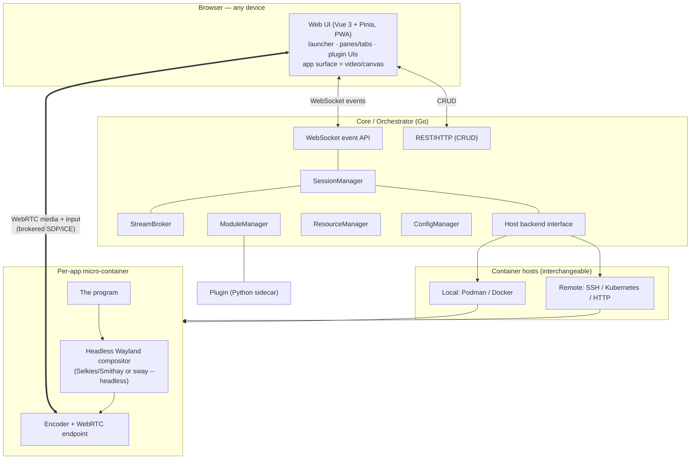
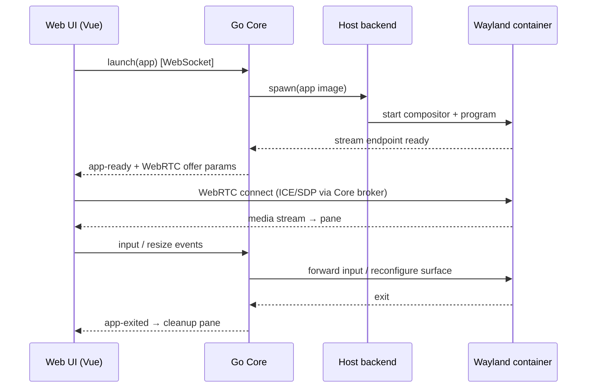

# SandboxDesktop — Architecture

> Status: design / pre-implementation. This document is the source of truth for the project's
> direction. Individual decisions are recorded as ADRs under [`adr/`](adr/).

## 1. Goal & principles

SandboxDesktop uses the browser to hold the **full user interface**. Programs do not run against the
user's local display server; each runs inside its own **Wayland** micro-container — locally or on a
remote host — and is streamed into a web UI.

Principles:

1. **The UI is a website.** A Vue 3 PWA, openable in any browser. No embedded browser engine.
2. **One program, one sandbox.** Each app is a single-purpose Wayland micro-container.
3. **Wayland-native, no X11.** Per-client isolation is a security requirement, not a preference.
4. **Local ≈ remote.** Where a container runs is a backend detail behind one interface.
5. **Open transport over proprietary.** WebRTC, not a closed protocol.
6. **Extensible.** Plugins (Python sidecars) extend the core under capability tokens.

This is **not a window manager** and **not** a single embedded-browser app. It is a per-application,
container-backed **streaming workspace**.

## 2. High-level architecture

### Components

- **Web UI — Vue 3 + Pinia (PWA).** The whole interface: an app launcher, a layout of panes/tabs/
  draggable panels, a command palette, and plugin-contributed UI. Each running app appears as a
  `<video>`/canvas surface fed by its WebRTC stream. **Pinia** holds session and app-instance state
  (a flat set of sessions + layout — *not* a window tree, because this is not a WM). Shipped as static
  assets; installable as a PWA.
- **Core / Orchestrator — Go.** The control plane. A single binary that:
  - exposes a **WebSocket event API** (app launched/ready/exited, stream negotiation, focus, resize,
    plugin events) and a thin **REST/HTTP** surface for CRUD;
  - runs a goroutine per session; uses `coder/websocket` (or `gorilla/websocket`) and `net/http`/chi;
  - owns lifecycle via `SessionManager`, stream negotiation via `StreamBroker`, plugins via
    `ModuleManager`, access/contexts via `ResourceManager`, and config via `ConfigManager`
    (vocabulary carried forward from the project's original design; `WindowManager` is retired).
- **Host backend abstraction.** One Go interface, two implementations: **local** (Podman/Docker
  socket) and **remote** (SSH / Kubernetes / HTTP API). Interchangeable from day one.
- **Per-app micro-container.** Runs one program against a **headless Wayland compositor** (Selkies's
  Rust/Smithay compositor, or `sway --headless` + wayvnc), with an encoder exposing a WebRTC endpoint.
- **Stream transport.** WebRTC for low-latency, GPU-accelerated media (H.264 / H.265 / AV1) with input
  back-channel; WebSocket pixel fallback. The Go core brokers and authenticates session setup
  (SDP/ICE), but media flows browser ↔ container directly.
- **Plugins.** Register with the core under a **capability token** (carried forward from the original
  README's module-auth idea), may be **Python sidecars**, and contribute Vue UI + react to events.

## 3. Data flow

## 4. Technology challenge

The original stack (see git history) was re-founded. Each choice was challenged:

| Original | Verdict | Recommendation & why |
|----------|---------|----------------------|
| **React** | Replaced | **Vue 3**. Single-file components + fine-grained reactivity suit a streaming workspace; per project direction. |
| **Redux** | Replaced | **Pinia**. State is sessions + app instances + layout — Pinia's light stores fit; Redux boilerplate was unjustified. |
| **Python (core)** | Demoted | Kept only for **plugins** (excellent for an SDK + system access via sidecars); a poor fit for the latency-sensitive core. |
| **Flask + REST** | Replaced | **Go**, WebSocket-first. REST polling cannot carry real-time stream/session events; Go gives concurrency + a single deployable binary aligned with container orchestration. |
| **CEF (embedded Chromium)** | Dropped | "The UI is a website" → a **Vue PWA** in any browser. No embedded Chromium, no Electron/Tauri — lighter and truer to the goal. |
| **X11** | Removed | **Wayland only** (§5). |

## 5. Wayland-only investigation

**Decision: commit fully to Wayland; no X11, no XWayland fallback.** (See
[ADR-0002](adr/0002-wayland-only-no-x11.md).)

- **Isolation (decisive).** Under X11 any client can read every other client's input and window
  contents. For a system that runs **untrusted user modules**, that is disqualifying. Wayland isolates
  each client to its own surface — apps cannot snoop each other.
- **Streaming efficiency.** Wayland's **damage tracking** lets the compositor encode only the regions
  that changed, which pairs naturally with WebRTC/GStreamer for low-latency, GPU-accelerated frames —
  the approach Selkies uses.
- **Maturity (2026).** Selkies — the engine behind **Webtop 4.x** — runs apps on a headless Wayland
  compositor (Rust/Smithay) and streams to the browser over WebRTC/WebSocket. Webtop explicitly
  **dropped X11/KasmVNC**. The Wayland path is now the production-grade one.
- **No XWayland.** Keeping the stack purely Wayland preserves the isolation model and keeps the runtime
  lean. **Legacy X11-only apps are an explicit non-goal.**

## 6. Reference systems (including Shadow)

| System | Model | Transport | Granularity | Relation to this project |
|--------|-------|-----------|-------------|--------------------------|
| **Shadow** | Whole Windows PC in the cloud | **Proprietary** (H.265, ~20–50 ms), thin "any browser" client | Whole machine | Reference *ceiling*. Borrow: codec strategy (H.265/AV1), adaptive low-bandwidth mode, overlap decode+display to cut latency. Reject: proprietary protocol, whole-OS granularity. |
| **Selkies / Webtop** | Containerized Linux desktop | Open WebRTC/WebSocket, Wayland/Smithay | Whole desktop | Closest base to build on or vendor. |
| **Kasm / neko** | Containerized app/desktop streaming | WebRTC | Desktop / single app | Precedents for container-per-session streaming. |
| **SandboxDesktop** | Per-app sandbox workspace | Open WebRTC | **Per application** | Open transport (like Selkies) + **per-application** Wayland containers (finer than Shadow/Webtop) + a Vue workspace UI. |

Note on Shadow: they chose a **proprietary heavyweight protocol over WebRTC** deliberately, because
"WebRTC doesn't allow some things." That is the right call for a commercial whole-PC product chasing
peak latency; it is the **wrong** call here, where openness, browser-native clients, and per-app
granularity matter more than the last few milliseconds.

## 7. Sandboxing posture

- One program per container; **Podman rootless** as the baseline.
- **gVisor** (or **Kata Containers**) as opt-in stronger isolation for untrusted modules, where the
  per-syscall / VM boundary is worth the overhead.
- Wayland per-client isolation (§5) is the in-container complement to container-level isolation.

## 8. Roadmap

1. **P1 — Docs.** This architecture + the ADRs. *(current)*
2. **P2 — PoC.** One Wayland app in a container streamed to a static page; validate the Selkies path.
3. **P3 — Core + UI.** Go orchestrator (`SessionManager`/`StreamBroker` + host abstraction) and the
   Vue workspace.
4. **P4 — Plugin SDK.** Python sidecar SDK with capability tokens.

## Sources

- LinuxServer Webtop 4.0 — Wayland: <https://www.linuxserver.io/blog/webtop-4-0-wayland-is-here-engage-the-reality-engine>
- LinuxServer Webtop 4.1 — "X11 is dead / what is Selkies": <https://www.linuxserver.io/blog/webtop-4-1-x11-is-dead-and-what-is-selkies-anyway>
- Selkies project: <https://github.com/selkies-project/selkies>
- wayvnc (VNC for wlroots/Wayland): <https://github.com/any1/wayvnc>
- neko (self-hosted WebRTC browser/app streaming): <https://github.com/m1k1o/neko>
- Shadow: <https://shadow.tech> · <https://en.wikipedia.org/wiki/Shadow.tech>
- gVisor: <https://gvisor.dev/>
